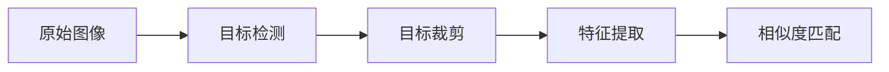
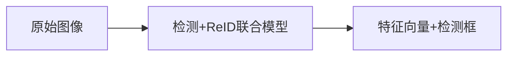

### **1. 数据集理解与准备**
#### **1.1 重识别数据集的特点**
- **核心要求**：
  - 同一目标（如行人、车辆）在不同摄像头、不同时间下的多张图像。
  - 每张图像标注目标**唯一ID**（而非类别标签），例如行人ID=001在摄像头A和B中均有图像。
- **常见结构**：
  ```python
  dataset_root/
  ├── train/
  │   ├── id_001/  # 同一ID的多个图像
  │   │   ├── cam1_001.jpg  # 摄像头1拍摄
  │   │   ├── cam2_003.jpg  # 摄像头2拍摄
  │   ├── id_002/
  │   │   ├── cam1_005.jpg
  │   │   └── cam3_002.jpg
  ├── test/
  │   ├── query/  # 待查询图像
  │   │   ├── 0001_c1.jpg  # 格式：ID_cameraID.jpg
  │   ├── gallery/  # 候选库图像
  │   │   ├── 0001_c2.jpg
  ```

#### **1.2 常用公开数据集**
- **行人重识别**：
  - Market-1501（1501个ID，6个摄像头）
  - DukeMTMC-reID（1404个ID，8个摄像头）
  - MSMT17（4101个ID，15个摄像头，更复杂光照变化）
- **车辆重识别**：
  - VeRi-776（776辆车，20个摄像头）
  - VehicleID（26,267辆车，多视角）

#### **1.3 数据标注工具**
- 若需自建数据集，可使用：
  - **CVAT**（标注边界框和ID）
  - **LabelImg** + 自定义脚本关联同一目标的跨摄像头图像。

---

### **2. 整体架构设计**
#### **2.1 经典两阶段流程**

- **阶段1：目标检测**（可选）
  - 模型：YOLOv8、Faster R-CNN（检测行人/车辆）。
  - 输出：裁剪后的目标图像（如112×224像素的行人区域）。
- **阶段2：重识别模型**
  - 输入：裁剪后的目标图像。
  - 输出：高维特征向量（如256维）。

#### **2.2 端到端联合模型**

- 模型：JDE（Joint Detection and Embedding）、FairMOT。
- 优势：共享主干网络，效率更高。

---

### **3. 局部模块详解**
#### **3.1 特征提取网络**
- **Backbone选择**：
  - CNN：ResNet50（常用）、OSNet（专为ReID设计）
  - Transformer：ViT、TransReID（利用注意力机制）
- **关键结构**：
  - **Global Feature**：通过全局平均池化（GAP）生成整体特征。
  - **Local Feature**：水平分块（Part-based）提取局部特征，解决遮挡问题。
  - **Attention机制**：如CBAM，聚焦目标关键区域。

#### **3.2 损失函数设计**
- **分类损失**：
  - Softmax Cross-Entropy：将ReID视为分类任务（每个ID为一类）。
- **度量学习损失**：
  - Triplet Loss：拉近同类特征，推开异类特征。
  - Circle Loss：优化相似度阈值，更稳定。
- **联合训练**：
  ```python
  total_loss = ce_loss + 0.5 * triplet_loss  # 加权结合
  ```

#### **3.3 相似度匹配**
- **距离度量**：
  - 余弦相似度：最常用，计算特征向量夹角。
  - 欧氏距离：需特征归一化（L2归一化）。
- **重排序（Re-ranking）**：
  - 利用近邻关系优化初始排名（如k-reciprocal编码）。

---

### **4. 数据流程与训练技巧**
#### **4.1 数据预处理**
- **图像增强**：
  - 随机裁剪、翻转、颜色抖动（模拟光照变化）。
  - **遮挡模拟**：随机擦除（Random Erasing）提升鲁棒性。
- **归一化**：
  - 像素值归一化到[-1, 1]或[0, 1]。

#### **4.2 训练流程**
1. **预训练Backbone**：在ImageNet或大型ReID数据集上初始化。
2. **微调**：
   - 固定浅层参数，训练顶层特征层。
   - 逐步解冻所有层，使用更小学习率（如1e-5）。
3. **测试评估**：
   - **mAP**（Mean Average Precision）：综合考量排名准确性。
   - **CMC曲线**（Rank-1, Rank-5准确率）。

#### **4.3 部署优化**
- **特征压缩**：PCA降维减少存储开销。
- **实时性优化**：
  - 量化（FP32 → INT8）
  - 使用TensorRT加速推理。

---

### **5. 进阶研究方向**
- **跨域适应**：解决训练集和测试集分布差异（如天气变化）。
- **无监督ReID**：无需标注ID，利用聚类生成伪标签。
- **视频ReID**：利用时序信息（如3D CNN、光流）。

---

### **6. 工具与代码库推荐**
- **框架**：
  - PyTorch：FastReID、Torchreid
  - TensorFlow：TF-Slim（自定义实现）
- **部署**：ONNX、TensorRT

---

### **总结**
- **数据集**：确保ID标注和跨摄像头覆盖。
- **架构**：从两阶段（检测+ReID）过渡到端到端。
- **核心技术**：特征提取、度量学习、注意力机制。
- **评估**：mAP和CMC是黄金指标。

通过逐步实践上述模块（如先复现Market-1501上的ResNet50基线），再探索最新论文（如TransReID），可系统掌握ReID技术。